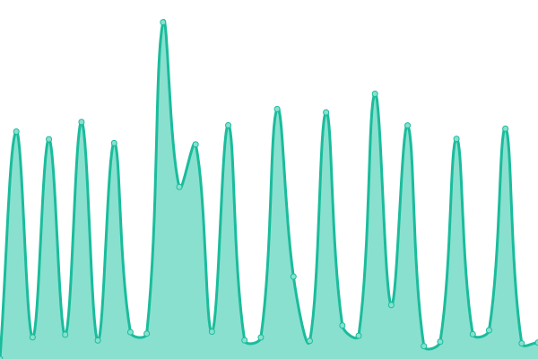
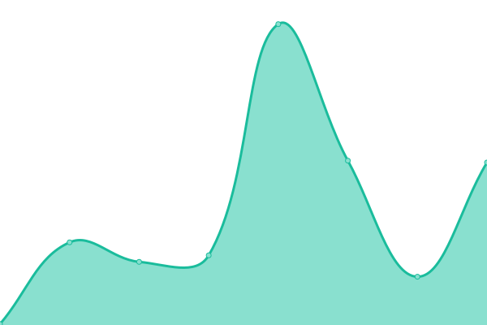

# [📈 Live Status](https://status.turtle84375.tk): <!--live status--> **🟨 Degraded performance**

This repository contains the open-source uptime monitor and status page for [Turtle](https://turtle84375.tk), powered by [Upptime](https://github.com/upptime/upptime).

With [Upptime](https://upptime.js.org), you can get your own unlimited and free uptime monitor and status page, powered entirely by a GitHub repository. We use [Issues](https://github.com/Turtle84375/status/issues) as incident reports, [Actions](https://github.com/Turtle84375/status/actions) as uptime monitors, and [Pages](https://status.turtle84375.tk) for the status page.

<!--start: status pages-->
<!-- This summary is generated by Upptime (https://github.com/upptime/upptime) -->
<!-- Do not edit this manually, your changes will be overwritten -->
<!-- prettier-ignore -->
| URL | Status | History | Response Time | Uptime |
| --- | ------ | ------- | ------------- | ------ |
|  [Turtle84375 (main domain)](https://turtle84375.tk) | 🟩 Up | [turtle84375-main-domain.yml](https://github.com/Turtle84375/status/commits/HEAD/history/turtle84375-main-domain.yml) | 

 2552ms
     
 | 

<a href="https://status.turtle84375.tk/history/turtle84375-main-domain">79.19%</a>
    

|  [Turtle84375 Chat](https://chat.turtle84375.tk) | 🟨 Degraded | [turtle84375-chat.yml](https://github.com/Turtle84375/status/commits/HEAD/history/turtle84375-chat.yml) | 

 3358ms
     
 | 

<a href="https://status.turtle84375.tk/history/turtle84375-chat">0.00%</a>
    

|  [Turtle84375 Community](https://community.turtle84375.tk) | 🟩 Up | [turtle84375-community.yml](https://github.com/Turtle84375/status/commits/HEAD/history/turtle84375-community.yml) | 

 2130ms
     
 | 

<a href="https://status.turtle84375.tk/history/turtle84375-community">79.18%</a>
    

|  [Turtle84375 Status (this site)](https://status.turtle84375.tk) | 🟩 Up | [turtle84375-status-this-site.yml](https://github.com/Turtle84375/status/commits/HEAD/history/turtle84375-status-this-site.yml) | 

 318ms
     
 | 

<a href="https://status.turtle84375.tk/history/turtle84375-status-this-site">79.22%</a>
    

<!--end: status pages-->

[**Visit our status website →**](https://status.turtle84375.tk)

## 📄 License

- Powered by: [Upptime](https://github.com/upptime/upptime)
- Code: [MIT](./LICENSE) © [Turtle](https://turtle84375.tk)
- Data in the `./history` directory: [Open Database License](https://opendatacommons.org/licenses/odbl/1-0/)
